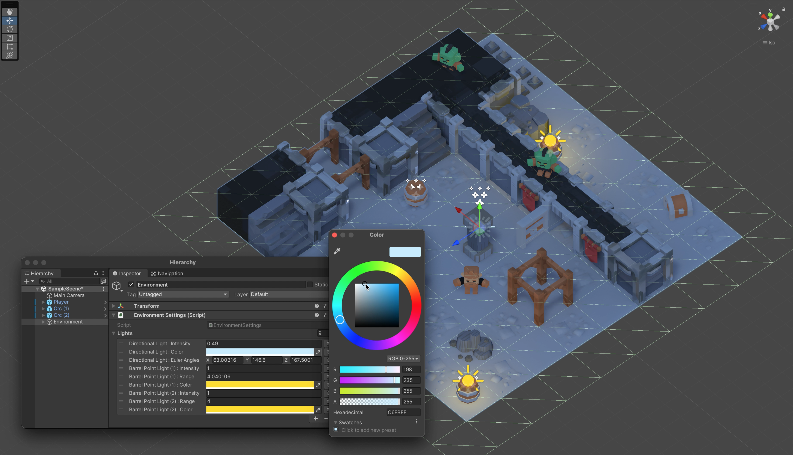

# PropertyRefs for Unity

[]()
[]()
[]()

[//]: # ([![Asset Store]&#40;https://img.shields.io/badge/asset_store-available-blue.svg?logo=unity&#41;]&#40;https://assetstore.unity.com&#41;)
[](https://www.npmjs.com/package/games.monogum.bricksbucket.propertyrefs)
[](https://www.paypal.com/donate/?hosted_button_id=QY4PCGA8FMCC4)

PropertyRefs is a comprehensive tool for Unity, crafted to streamline your game development tasks. By creating references to the properties of the components, you can efficiently access and manipulate them from other scripts, centralizing meaningful properties of a game object, prefab, or a scene in one location. This is a significant advantage for game and level designers, offering an enhanced and seamless workflow.


## Features

### Access from Editor

With a custom property drawer, PropertyRefs provides an intuitive interface for gathering all significant properties in one place. This not only eliminates the tedious search through countless properties but also promotes a cleaner, more organized codebase.

### Access from Code

Developers have the flexibility to modify the values of the PropertyRefs programmatically. For more information on how to access and modify properties programmatically, please refer to the [Property Access Methods](#property-access-methods) section. 

### AOT Systems Support

PropertyRefs is equipped with a dual-mode functionality. Initially, it uses System Reflection to access the values of component properties. However, for AOT systems, where System Reflection is not applicable, PropertyRefs seamlessly switches to a Roslyn Source Generator. For more details on how AOT systems are supported, please see the [AOT Systems Support and Code Generation](#aot-systems-support-and-code-generation) section.

## Requirements

The PropertyRefs package is currently supported on `Unity 2021.3.17f1`. Usage in other versions of Unity may result in unexpected behavior. Please ensure your Unity environment meets this requirement before installation to guarantee the package's optimal functionality.

## Installation

There are several methods available to install PropertyRefs into your Unity project. Choose the one that best suits your needs. It's recommended to install via npm if you wish to keep the package up-to-date easily, as future releases and updates will be readily available.

### Installation via npm

To add PropertyRefs from a npm registry in Unity, follow the steps below:

1. Open your Unity project and navigate to `Edit > Project Settings > Package Manager`.
2. In the `Scoped Registries` section, click on the `+` button to add a new scoped registry.
3. Fill in the required fields:
    - Name: Enter `Monogum`.
    - URL: Enter `https://registry.npmjs.org`.
    - Scope(s): Enter `games.monogum.bricksbucket`.
4. Click `Save` and close the Project Settings window.
5. Navigate to `Window > Package Manager`.
6. In the package manager window, select `Packages: My Registries`.
7. You should see the `games.monogum.bricksbucket.propertyrefs` package listed there. Click `Install` to install the package.

Alternatively, you can directly modify your `Packages/manifest.json` file to add the new scoped registry and the dependency:

1. Add the following scope to the `scopedRegistries` in your `manifest.json` file:
```json
{
  "scopedRegistries": [
    {
      "name": "Monogum",
      "url": "https://registry.npmjs.org",
      "scopes": ["games.monogum.bricksbucket"]
    }
  ]
}
```
2.	Then, add `games.monogum.bricksbucket.propertyrefs` to the dependencies section of your `manifest.json` file:
```json
{
  "dependencies": {
    "games.monogum.bricksbucket.propertyrefs": "1.0.0"
  }
}
```
Ensure to replace 1.0.0 with the version number of the PropertyRefs package you intend to install. Save your manifest.json file after making these changes.

### Installation via Cloning

To install PropertyRefs by cloning the repository and adding the package from disk, follow these steps:

1. Clone this repository to your local machine.
```shell
git clone https://github.com/javier-games/property-refs.git
```
2. Open your Unity project and navigate to `Window > Package Manager`.
3. In the Package Manager window, click on the `+` icon in the top-left corner.
4. From the dropdown, select `Add package from disk...`. 
5. A file explorer window will open. Navigate to the location where you cloned the repository.
6. Find and select the `package.json` file within the cloned repository and click `Open`.

Unity will automatically detect and install the package. The package should now be listed in the Package Manager.

### Install Specific Versions

Alternatively if you only need a specific version of the project you can select the `Add package from git URL...` and introduce the url of this repository.
```
https://github.com/javier-games/property-refs
```
Also you can download the tarball file (`games.monogum.bricksbucket.propertyrefs-{version}.tgz`) from the [releases section](https://github.com/javier-games/property-refs/releases) of this repository and add it throw the `Add package from tarball...` option.

## Usage

PropertyRefs is designed with an intuitive interface to ensure a seamless and user-friendly experience. To use PropertyRefs in your projects, follow the general usage instructions below:

### General Usage

To establish a reference to the properties of your components, declare a private `SerializedProperty` or a public field of `PropertyRef` type in a custom class. Once declared, the Inspector will allow you to select the component and the property for the reference.

```csharp
using System.Collections.Generic;
using UnityEngine;
using Monogum.BricksBucket.PropertyRefs;

public class PrefabProperties : MonoBehaviour
{
   [SerializeField]
   private PropertyRef myPropertyRef;
   
   [SerializeField]
   private List<PropertyRef> myListOfProperties;
}
```

You can also declare a list of `PropertyRef` instances. In this mode, PropertyRefs conveniently labels the properties in the list with the name of the game object and the property. This labeling facilitates easier identification of properties.



### Property Access Methods

To ensure that a newly created component's properties are identifiable by PropertyRefs, the properties must be declared with read and write access. If a property lacks read and write access, PropertyRefs won't be able to identify it.

```csharp
using UnityEngine;

public class CustomComponent : MonoBehaviour
{
    public float MyFindableProperty { get; set; }
}
```

Moreover, PropertyRefs enables you to modify and obtain the value of the `PropertyRef` programmatically. However, caution is advised as this option doesn't recommend the assignment of values that are of a different type to the `PropertyRef`. If such an assignment occurs, the value of the `PropertyRef` will remain unchanged.

```csharp
using UnityEngine;
using Monogum.BricksBucket.PropertyRefs;

public class EditableProperty : MonoBehaviour
{
    [SerializeField]
    private PropertyRef myEditablePropertyRef;

    private void Start()
    {
        var value = (float) myEditablePropertyRef.GetValue();
        Debug.Log($"My value is {value}");

        value += 5;
        myEditablePropertyRef.SetValue(value);
        Debug.Log($"My new value is {value}");
    }
}
```

### AOT Systems Support and Code Generation

PropertyRefs includes a built-in Roslyn source generator for supporting Ahead-Of-Time (AOT) systems, like iOS. To activate this feature, locate a `Registry.PropertyRefsSourceGenerator.additionalfile` file somewhere in your project. This file serves as a registry for the properties you can use.

When a component or a property that isn't registered is assigned to a `PropertyRef`, it will display an option for you to register them. This ensures that your AOT system is fully supported and that your property references are generated correctly. The JSON file below is a sample of how the registry is conformed.

```json
{
   "components": [
      {
         "type": "UnityEngine.Transform", 
         "properties": [
            {
               "name": "position", 
               "type": "UnityEngine.Vector3"
            }
         ]
      }
   ]
}
```

With these features and flexible options, PropertyRefs aims to enhance your Unity development experience, offering an enhanced and seamless workflow.

## License

PropertyRefs is available under the MIT license. See the [LICENSE](LICENSE) file for more info.

## Contribution

Please read our [Contributing Guide](CONTRIBUTING.md) before submitting a Pull Request to the project.

## Support

For any questions or issues, please open a [new issue](https://github.com/javier-games/property-refs/issues/new) on this repository.

## Donations

PropertyRefs is a open source project, and it's because of your support that we can stay up and running. If you find this project useful, please consider [making a donation](https://www.paypal.com/donate/?hosted_button_id=QY4PCGA8FMCC4). Your contribution will help us to maintain the project, and continue to develop new features. We appreciate your generosity!

## Acknowledgements

We would like to express our gratitude to [Kenney](https://www.kenney.nl) for providing the assets used to create the sample images in this repository. These assets are under the Creative Commons Zero (CC0) license.

Kenney's contribution to the gaming community is significant and invaluable. We strongly encourage you to support his work by making a donation on [Kenney's Donation Page](https://www.kenney.nl/donate) or becoming a patron on [Patreon](https://www.patreon.com/kenney).
